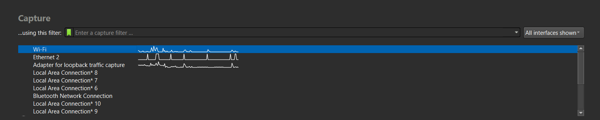
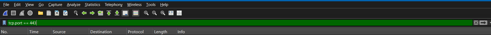
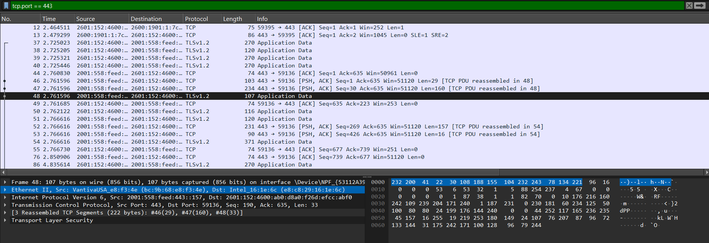
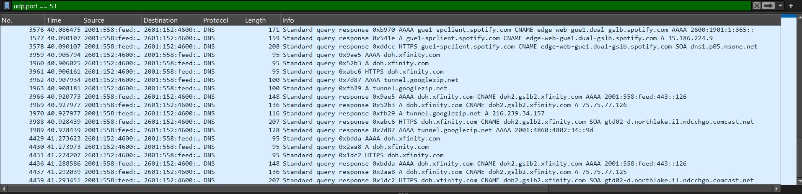
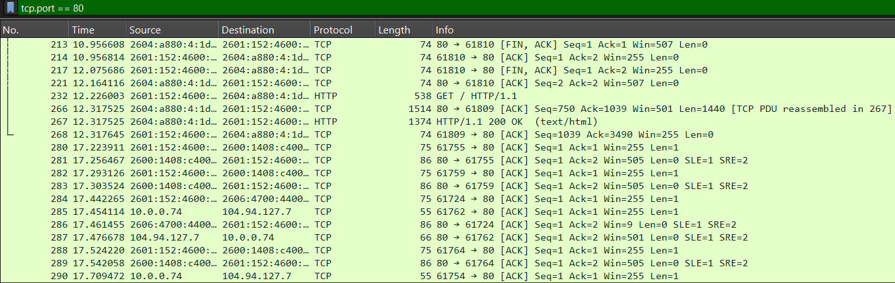
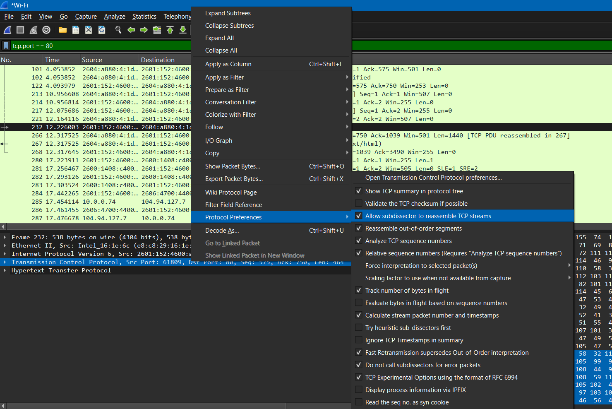
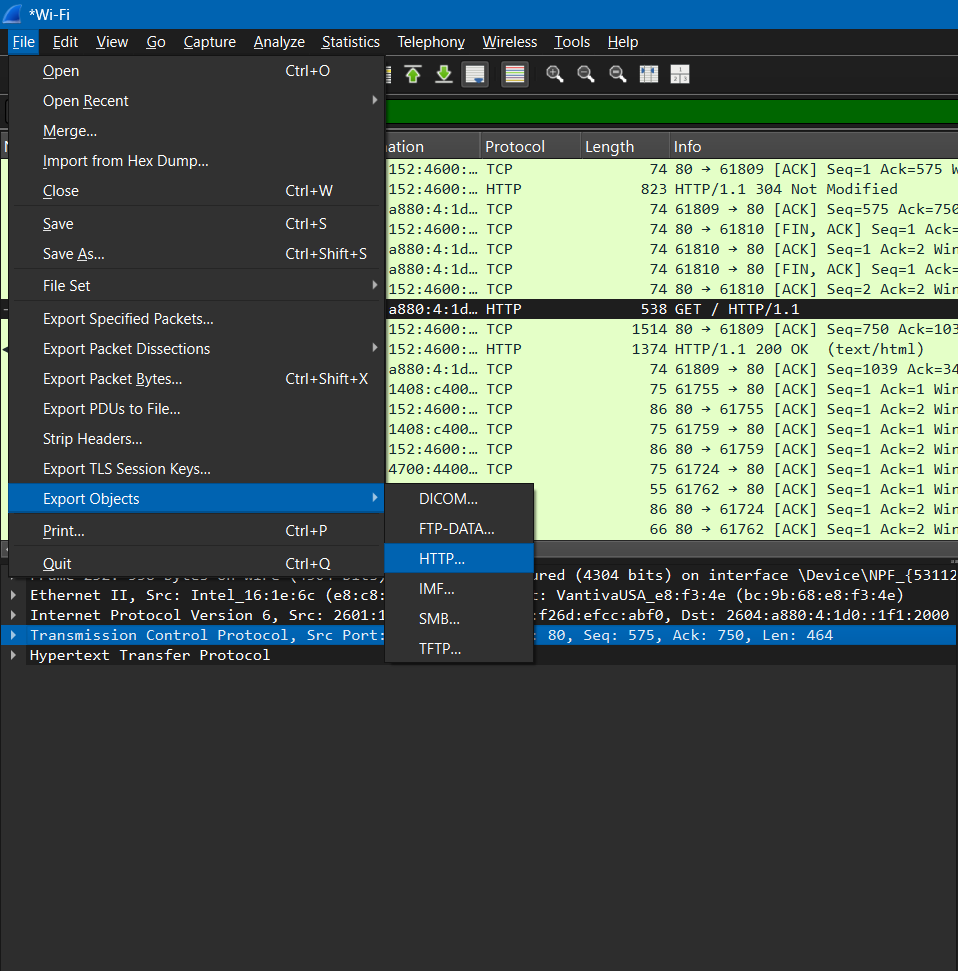
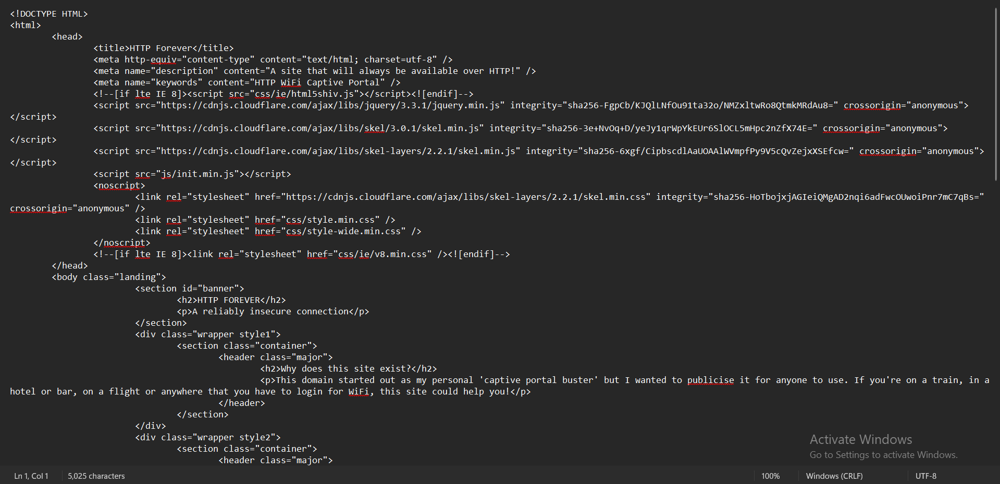

# Analyizing Traffic with Wireshark
## Tools Used
* Wireshark
* Web browser
## Descritpion
* In this project, I am going to be using Wireshark to capture network traffic and analyze the packets by using different filters available and also identify different protocols used when visiting a website. I am going to take advantage of the many feature Wireshark has from filtering packets to viewing data in **unencrypted HTTP** traffic. I will be attaching the pcap file I used in this project to download for use and step by step guide.
## Guide
1. Download and Install Wireshark
2. Choose either your WiFi or Ethernet, then start capturing packets

3. On a web browser, visit a secure **HTTPS** page, like Google

Wait until the page has loaded.
4. Stop the capture, and you will be presented with a list of many packets aling with different information like protocols used, source and destination addresses, time, etc
5. Since we are going to be only analyzing HTTPS traffic only,  we will be using the **"tcp.port == 443"** filter in the filter box.

6. You will be presented with packets that use the HTTPS port: 443. Now, we have an option to see where each packet is going to and coming from by clicking on it and inspecting the information in the subfields.

7. Similarily, to filter out DNS traffic, we will be using the filter **"udp.port == 53"**

## Extracting data from HTTP traffic
1. For this task, we will be capturing new traffic and visit http://httpforever.com
2. We will filter the packet by **"tcp.port == 80"**

#### **NOTE**: To ensure that Wireshark reassembles TCP streams 
Select a HTTP GET request then right click on the Transmission Control Protocol from the Packet Details Tab, then check the "Allow subdissector to reassemble TCP streams" box

3. We will then click on File then Export Object and choose HTTP

Save it to desired location.
4. Opening up the file using notepad, we get a HTML file of the website we loaded.

#### NOTE: This also works for images and any other data transmitted using HTTP